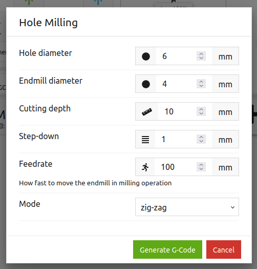
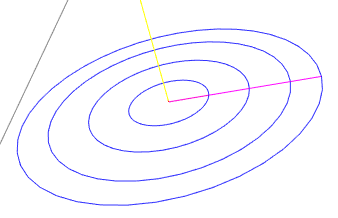
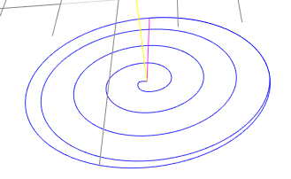

# Purpose
Simple macro for `OpenBuilds CONTROL` to mill a hole at 0/0/0

# Installation
Copy the content of `src/ob-hole-milling-macro.js` and save it into a new macro within `OpenBuilds CONTROL`.

# Description
This macro generates a sequence of G-Codes to mill a (vertical) hole into some stock at 0/0/0 (x/y/z). The generated code will replace the one in the G-Code editor, and triggers the parsing and visualization of the code in the 3D viewer.

## Usage
When starting the macro it opens up a dialog to enter the milling parameters:



### Hole and Endmill diameter
You need to specify the diameter of the endmill being used, as well as the hole diameter. 
```
Note: If the hole diameter is smaller than the endmill diameter, then the macro will not generate / update any G-Code!
```
If the hole diameter is equal to the endmill diameter, then the operation is equal to a drilling operation (i.e. moving the endmill vertical in z direction only). Otherwise, the complete hole body will be milled.

```
Note: Depending on your machine setup and material, the resulting hole might be smaller or even larger than the target. In this case adjust the target diameter by the messured difference.
```
### Receipe
There are two base receipe implemented by which the area is being milled: 
* `circle`: by milling in concentric growing circles. <br> 
* `spiral`: by milling in a (approximated) spiral. <br> 

Each has two additional options which steers the milling direction:
* `cw`: clock-wise milling (usually against the rotation of the endmill), aka *conventional milling*
* `ccw`: counter-clock-wise milling (usually towards the endmill rotation), aha *climb milling*

The milling direction can be defined for the rough cutting, as well for the finishing process if not disabled. As a result the receipes are following the following naming convention:
```
<milling methon>-<rough cut direction>-<finishing direction>
e.g.
spiral-ccw-cw
```

### Cutting depth
Defines how deep to mill the pocket / hole into the material. Usually, this is being dome in multiple layers (see DOC).

### DOC (depth of cut)
Milling is being done in layers. The DOC defines how deep the endmill mills in each layer (might be lower for the final layer). This depth is expressed as a percentage of the endmill diameter. U 

### WOC (width of cut)
The layers being milled will cut the material based on the receipe selected. The WOC defined how deep the endmill mills into the material on the current depth layer. Again, this value is given as a percentage to the endmill diameter.

### Finish WOC
If you prefer to split the milling operation into a rough cutting and finishing part, you cen defined the WOC used for the very last circle being milled. A value of 0 disbles the finishing loop.

### Feedrate
The maximum feedrate used during the milling operation.

# Development
For the development I use `VS Code` running on linux. As the macros in `OpenBuild CONTROL` are stored in an internal DB, you need to copy and paste your modified code into one macro.

## Testing
There is a testsuite based on `jest` to test if the generated g-code fits the expectations. The setup is based on `npm`. If you want to run the tests, you also need to install the development dependencies with `npm install`.

To run the tests themself, simply start `npm test`.

```
Note: As of now the tests are disabled, as they are based on an older set of receipes.
```

## Fixes 
Whenever you perform fixes, it is a good idea to start to add a test which should fail with the existing code. Next, fix the bug. Once the bug is fixed, your new / adjusted test should no longer fail.

## Enhncements
The same is true for enhancements. First add a test, let it fail, then add the code and let the test succeed.

