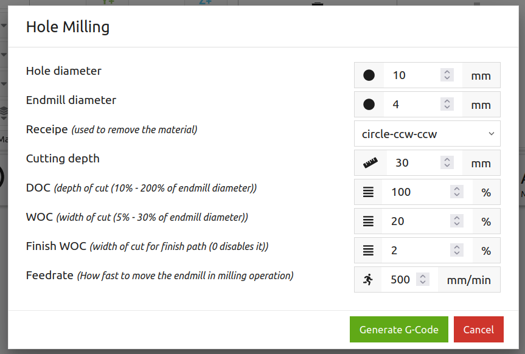

# Purpose
Simple macro for `OpenBuilds CONTROL` to mill a hole at 0/0/0

# Installation
Copy the content of `src/ob-hole-milling-macro.js` and save it into a new macro within `OpenBuilds CONTROL`.

# Description
This macro generates a sequence of G-Codes to mill a (vertical) hole into some stock at 0/0/0 (x/y/z). The generated code will replace the one in the G-Code editor, and triggers the parsing and visualization of the code in the 3D viewer.

## Usage
When starting the macro it opens up a dialog to enter the milling parameters:



### Hole and Endmill diameter
You need to specify the diameter of the endmill being used, as well as the hole diameter. 
```
Note: If the hole diameter is smaller than the endmill diameter, then the macro will not generate / update any G-Code!
```
If the hole diameter is equal to the endmill diameter, then the operation is equal to a drilling operation (i.e. moving the endmill vertical in z direction only). Otherwise, the complete hole body will be milled.

### Overlapping
When milling the hole an overlap of 50% is used for each circle. E.g. when using a 4mm endmill, the overlap will be 2mm.

### Step-Down
The milling opereation will be done in vertial layers, starting at 0. The `step-down` defines the distance between the layers. If the `step-down` is larger than the hole deepth, it will be reduced to the deepth. The same is true if the remaining height of the last layer is less then the `step-down` height.

### Direction
Three options exists on how to processs the layers:
* `zig-zag`: mill down on the current position, either in the center of the outer edge.
* `to-center`: always mill down on the outer edge, then mill in center direction
* `to-outer`: always mill down in the center, then mill to the outer edge.

Using `zig-zag` provides the fastest path, but might lead to steps on the holes outer surface. `to-outer` can lead to a hole of a slightly smaller diameter, dependeing your maching. `to-center` might lead to the oposite.

You should test your machine with some sample mills to determine if you need to extend / reduce the target hole diameter.

### Counter-Clock-Wise
The generated gcode mills in circles, counter-clock-wise.

# Development
For the development I use `VS Code` running on linux. As the macros in `OpenBuild CONTROL` are stored in an internal DB, you need to copy and paste your modified code into one macro.

## Testing
There is a testsuite based on `jest` to test if the generated g-code fits the expectations. The setup is based on `npm`. If you want to run the tests, you also need to install the development dependencies with `npm install`.

To run the tests themself, simply start `npm test`.

## Fixes 
Whenever you perform fixes, it is a good idea to start to add a test which should fail with the existing code. Next, fix the bug. Once the bug is fixed, your new / adjusted test should no longer fail.

## Enhncements
The same is true for enhancements. First add a test, let it fail, then add the code and let the test succeed.

